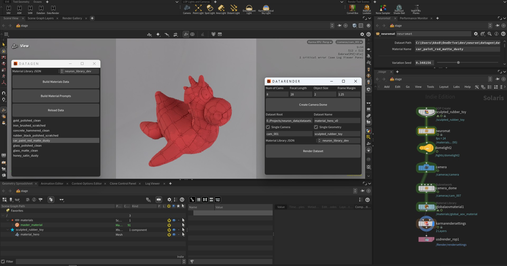

# Neuron


Neuron is a personal generative-AI research project built from the ground up to learn how text-conditioned image generation works. Its first milestone, **Material Hero**, generates the rendered appearance of one fixed 3D object from a material description.

Example prompts:

- `gold brushed dirty`
- `black rubber polished scratched`
- `clear glass clean`

The first training release is deliberately narrow: many materials, one geometry, one fixed camera, and controlled studio lighting. The same model is then exercised with unsupported Three.js camera and mesh inputs before later datasets add multiple views and multiple geometries. This makes generalization something the project measures rather than assumes.

## Material Hero

Material Hero begins with a **Sculpted Rubber Toy** and one fixed training camera. Houdini procedurally renders that view with many combinations of material base, finish, condition, and color. Each image is linked to a canonical text description and aligned camera and geometry data.

The trained model will directly predict the final rendered RGB appearance. It will **not** generate PBR shader parameters or texture maps.

Conceptually, the first model learns:

```text
RGB = F(surface position, surface normal, view direction, text description)
```

Rasterized geometry supplies the surface and silhouette; the prompt controls its appearance. Dataset v0 supports the hero at the fixed training view. Orbit, zoom, and alternate supplied meshes are deliberate out-of-distribution tests until later training releases add those variations.

### Initial constraints

- One fixed hero geometry
- Controlled material vocabulary
- Fixed studio lighting and color-management configuration
- One fixed training camera for dataset v0
- Experimental camera and supplied-mesh changes in the Three.js app
- Direct RGB generation
- Deterministic appearance for a given prompt in the first version
- No arbitrary object or scene generation
- No generated shader graphs, material parameters, or texture maps
- No user-controlled relighting in the first version

These are intentional scope boundaries, not final limitations of the wider Neuron concept.

## Pipeline

```text
Houdini procedural materials
        |
        v
Versioned RGB images + prompts + camera/geometry buffers
        |
        v
Text-conditioned neural appearance model
        |
        v
Neuron web viewport on Hugging Face Spaces
```

### 1. Data generation

SideFX Houdini and Karma generate the synthetic ground-truth dataset. The material system includes procedural variation, dirt, wear, and bump signals; the fixed-camera stress renders have been approved and depth of field is disabled. The sequential `datarender` tool will be specified and implemented in stages before the eight-material automated pilot.

Each fixed-view v0 material folder contains one 1024 × 1024 multilayer EXR with:

- Beauty RGBA (`C.RGB` is the target and `C.A` is material-independent Coverage);
- world-space position `P`;
- smooth unbumped world-space normal `Nb` (the model's logical `N` input);
- world-space view direction `V`;

No separate Coverage AOV is stored. The material library changes transmission but does not drive opacity, so Beauty alpha remains geometry coverage for glass as well as opaque materials.

The copied `neuron_library_prod.json` supplies material IDs and prompts. Debug AOVs and separate camera/geometry metadata are intentionally omitted from dataset v0.

### 2. Training

The first training implementation learns prompt-conditioned appearance on one fixed hero view. Later checkpoints use multi-view and then multi-geometry datasets while preserving material-level splits and standardized comparison cases.

The training implementation has not been built yet. It begins after the Houdini dataset pilot and full material-folder batch have been checked.

### 3. Application

The intended application accepts a material prompt and sends Three.js-generated `P`, `N`, `V`, and Coverage buffers to the neural renderer. It starts at the Houdini training pose, then permits orbit, zoom, and mesh switching so failures of each dataset/model version can be observed directly.

The React application now loads `public/models/material_hero/sculpted-rubber-toy.glb` and displays its smooth world-space normal pass. The camera can orbit and reset to a stable reference view. A bottom-center prompt field accepts text but does not trigger rendering yet. The FastAPI backend still exposes only a status endpoint; neural inference is not connected.

This frontend slice runs locally. Prompt processing, model inference, the remaining geometry passes, backend changes, and Hugging Face deployment are deferred.

## Current status

The project is currently finishing **Phase 1: Houdini data generation**.

- The procedural material library and semantic label generator exist.
- A small stress-test material set is used to validate shader behavior.
- Variation, dirt, and wear systems are implemented in the Houdini material HDA.
- Stochastic, directional, and cellular bump branches are implemented and approved in fixed-camera stress renders.
- Dataset batching is designed but not yet implemented; final renders, training, and neural inference remain pending.
- The browser UI loads the hero and provides an orbitable normal-pass viewer, camera reset, and inactive prompt field; the backend remains a scaffold and no model is connected.

An Indie scene/HDA and an unwatermarked 1024 × 1024 pilot render are now verified. Dataset automation and the full stress-set pilot remain pending.

## Roadmap

### Phase 1 — Material dataset

- Finish and validate the Houdini material HDA.
- Use the validated 1024 × 1024 Beauty RGBA, `P`, unbumped `Nb`, and `V` outputs for the fixed training view, with `C.A` as Coverage.
- Render the material stress set.
- Automate and render the complete dataset.

### Phase 2 — Material Hero model

- Implement the dataset loader and validation tools.
- Establish a simple text-conditioned RGB baseline.
- Train the fixed-view baseline, then compare later multi-view and multi-geometry checkpoints.
- Evaluate both seen materials and held-out material combinations.
- Save a reproducible model artifact with its vocabulary and configuration.

### Phase 3 — Neuron application

- Extend the implemented Material Hero normal viewer with the remaining geometry buffers.
- Connect prompt and Three.js geometry buffers to model inference.
- Display generated RGB results interactively.
- Package and deploy the application on Hugging Face Spaces.

### Later research — persistent neural assets

The longer-term Neuron direction is a 3D application built from versioned neural assets: promptable objects, characters, and environments that can be referenced and composed into shots through a USD-like scene graph.

Material Hero is intended to become the first small neural asset and to test the foundational ideas of persistent model state, prompt conditioning, camera-aware rendering, versioning, and viewport integration. General neural geometry, multi-asset composition, relighting, deformation, and animation are future research and are not part of the current Material Hero milestone.

## Repository structure

```text
datagen/       Material definitions and Houdini data-generation tools
train/         Training package scaffold
neuron/        Future neural-engine package
src/           React and React Three Fiber frontend
public/models/ Deployable web geometry
main.py        FastAPI application and static frontend server
docs/          Canonical project documentation
docs/sources/  Historical briefs, exported chats, and source material
```

Start with [docs/START-HERE.md](docs/START-HERE.md) for the current status, decisions, specifications, and runbooks.

Files in `docs/sources/` preserve project history and rationale. They may contain outdated or speculative advice and are not, by themselves, the current specification.

## Run the app locally

### Development launcher

Double-click `neuron_dev.bat` to open the app at [http://127.0.0.1:5173](http://127.0.0.1:5173) with Vite hot reload. Install the JavaScript dependencies once with `npm ci` before using the launcher.

### Frontend development

Install the JavaScript dependencies and start the Vite development server:

```bash
npm ci
npm run dev
```

Open [http://localhost:5173](http://localhost:5173). This local frontend run loads the GLB directly from `public/models/` and does not require FastAPI.

### Production-style local run

```bash
npm ci
npm run build
python -m pip install -r requirements.txt
python -m uvicorn main:app --host 0.0.0.0 --port 7860
```

This serves the built frontend and the placeholder FastAPI backend on port `7860`.

### Docker

The included `Dockerfile` builds the React frontend and serves it through FastAPI using the same port expected by Hugging Face Spaces.

## Hugging Face

The repository is configured for a Docker-based Hugging Face Space. Deployment is planned after the first trained Material Hero model is integrated.
