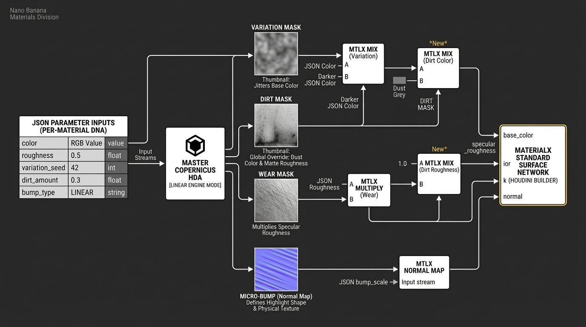

# Copernicus HDA: The Texture Engine Blueprint

The goal of your manual look-dev is to build a **Master Copernicus HDA** (Houdini Digital Asset). Instead of creating thousands of unique textures, you are creating a single, intelligent "Texture Engine" that generates different results based on the JSON parameters you feed it.

Here is the blueprint for the outputs you need to define and how they integrate into your `BuildMaterials` class.

---

## 1. The Output of Look-Dev: The "Big Four" Masks

Your Copernicus HDA should have one set of inputs (Seed, Dirt, Wear, etc.) and four primary output connectors. These outputs are not "colors" but **spatial probability maps**.

| Output Map | Logic | What it Teaches the AI |
| :--- | :--- | :--- |
| **Wear Mask** | High-frequency scratches + Edge highlights (via Curvature). | That edges are sharper/shinier than flat surfaces. |
| **Dirt Mask** | Low-frequency smudges + Crevice accumulation (via AO). | That "occlusion" leads to a loss of reflectivity and color shifts. |
| **Micro-Bump** | Directional "Brushed" lines or Cellular "Hammered" pits. | How micro-geometry affects the "shape" of a highlight (Anisotropy). |
| **Variation Map** | A subtle, multi-octave fractal noise. | That no real-world surface is perfectly uniform in color. |

---

## 2. The Finite Set of Procedural "DNA"

You don't need a unique Copernicus network for every material. You only need a few **Base Logic Groups** that you toggle via your script. During look-dev, build these three distinct procedural "flavors":

* **The "Linear" Engine:** (For brushed finishes). Uses directional anisotropic noise.
* **The "Cellular" Engine:** (For hammered or cast finishes). Uses Voronoi/Worley noise to create physical indentations.
* **The "Stochastic" Engine:** (For polished or matte finishes). Uses Fractal/Perlin noise for organic dust and smudges.

In your `BuildMaterials()` script, you will look at the `bump_type` in your JSON (e.g., directional, cellular) and tell the Copernicus HDA which "Flavor" to activate.

---

## 3. How BuildMaterials() Utilizes the Look-Dev

Once you have your Master Copernicus HDA, your Python script becomes a "Wiring Engine." Here is the logic the developer will add to the `_create_builder` method:

### Step A: Instance the Copernicus HDA
Inside each material subnet, the script will create an instance of your look-dev HDA.

### Step B: Driving the HDA with JSON
The script "pushes" the JSON data into the HDA parameters.

### Step C: The MaterialX "Mix" Nodes
Instead of a direct value, the script wires the Copernicus outputs into MaterialX Mix nodes.

* **Base Color:** `mtlxmix` (Input A: JSON Color | Input B: Dirt Color | Mask: Cop Dirt Mask).
* **Roughness:** `mtlxmultiply` (Input A: JSON Rough | Input B: Cop Wear Mask).

---

## 4. Why this is "Neural Hero" Grade

By using this HDA approach, you are ensuring **Coordinate Consistency**.

Because your HDA uses **Tri-planar projection** based on $P$ (position), the "Scratches" aren't just pixels—they are mathematical locations in 3D space. When you move the camera for your 200 renders, the INR (Neural Network) will see that a scratch at coordinates $(0.5, 0.2, 0.1)$ is consistent across every single frame.

---

## Summary Checklist for Look-Dev:

* [ ] Build a Copernicus HDA with inputs for Seed, Dirt, Wear, and Bump.
* [ ] Sample via Tri-planar inside the HDA so no UVs are required.
* [ ] Define the "Mix Logic" for how dirt should change a color (does it get darker? Browner?).
* [ ] Test the "Seed"—change the seed and ensure the scratches move to entirely new, random locations.

# Procedural Determinism: Magic Numbers & Noise Layering

To keep the **"Pro Move"** of hash-based determinism, you should definitely hardcode these numbers—but you should choose them strategically.

The goal of these numbers (often called "magic numbers" in procedural generation) is to ensure that different noise layers—like your **Dirt** and your **Scratches**—don't overlap or look like they are "twinned." If you used the same offset for both, a scratch would always appear exactly where a piece of dirt is, which looks fake.

---

## 1. Use "Large Prime" Hardcoding
The industry standard is to use large prime numbers or numbers with no common factors. This prevents **"aliasing"** or repeating patterns.

You should define a unique "Prime Offset" for each major noise type in your **Master Copernicus HDA**. This ensures that even though they all use the same `variation_seed`, they are sampling completely different neighborhoods of the 3D noise field.

### Example HDA Logic (Inside VEX or Parameter Expressions):

| Noise Layer | Multiplier X | Multiplier Y | Multiplier Z |
| :--- | :--- | :--- | :--- |
| **Dirt Noise** | 133.19 | 777.43 | -512.23 |
| **Scratch Noise** | 911.67 | -233.11 | 444.89 |
| **Micro-Bump** | 1024.5 | 15.9 | 888.31 |

By hardcoding these, you ensure that `gold_polished_dusty` will always have the exact same dirt and the exact same scratches every time you hit render, which is vital for your training consistency.

---

## 2. Why "Randomizing" is the Enemy
If you used a `rand()` function inside Houdini to pick those multipliers, you would break the pipeline:

* **Lost Reproducibility:** If you sent the file to a render farm or a colleague, their `rand()` might return a different value, and your "Material Hero" would look different.
* **Training Noise:** For an INR (Neural Network) to converge, the "Ground Truth" must be absolute. If the labels in your JSON point to an image that changes slightly every time you open the file, the network will struggle to map the text prompt to the visual features.

---

## 3. The "Infinite Fabric" Concept
Think of procedural noise as an infinite fabric wrapped around the universe.

1.  **The Noise Node** defines the pattern of the fabric.
2.  **The `variation_seed`** determines where you "cut" the fabric to dress your Shader Ball.
3.  **The Hardcoded Multipliers** ensure that your "Dirt" fabric and your "Scratch" fabric are being cut from different parts of the universe so they don't look related.

---

## 4. Implementation in `BuildMaterials()`
Since you are using the `variation_seed` as a 0–1 float, your Python script doesn't need to know about these magic numbers. It just passes the `0.123456` value to the HDA.

Inside the HDA, you can use a **Parameter Expression** on the noise offset:
`ch("variation_seed") * 133.19`

---

> ### Summary for the Developer
> **"Hardcode fixed prime-number multipliers for every noise-offset internal to the HDA. This decorrelates the Dirt, Wear, and Bump layers while maintaining the deterministic hash-based results provided by the variation_seed attribute."**

### 15 Safe Prime-Based Multipliers for Copernicus Noise Layers

These multipliers are chosen to be large, prime, or having non-repeating fractional components to ensure that your noise layers (Dirt, Scratches, Wear, etc.) are sampled from mathematically distant "neighborhoods" of the noise field.

| Layer Type | Multiplier X | Multiplier Y | Multiplier Z |
| :--- | :--- | :--- | :--- |
| **Primary Dust** | 173.89 | 541.21 | 227.17 |
| **Secondary Dirt** | 661.91 | 107.09 | 823.43 |
| **Micro-Scratches** | 941.11 | 313.37 | 499.19 |
| **Heavy Gouges** | 127.13 | 761.47 | 907.01 |
| **Edge Wear** | 431.63 | 199.97 | 617.29 |
| **Surface Oxidation** | 853.67 | 467.03 | 131.59 |
| **Water Stains** | 281.81 | 701.53 | 397.69 |
| **Oil/Grease Spots** | 593.59 | 149.23 | 881.71 |
| **Pitting/Corrosion** | 353.17 | 991.49 | 239.11 |
| **Fingerprints** | 719.93 | 523.61 | 167.41 |
| **Thermal Damage** | 443.83 | 827.29 | 601.07 |
| **Paint Flaking** | 317.21 | 103.91 | 773.51 |
| **Micro-Bump/Grain** | 997.33 | 419.59 | 151.01 |
| **Anisotropy Noise** | 647.47 | 383.13 | 919.67 |
| **Generic Var A** | 271.91 | 557.03 | 811.97 |

---

### Implementation Snippet (VEX / Parameter Expression)

If you are inside a **Copernicus Snippet** or a **VOP** node using the `variation_seed` parameter, your offset logic should look like this to ensure total decorrelation:

// Example for the 'Heavy Gouges' layer
float seed = chf("variation_seed");
vector offset = set(seed * 127.13, seed * 761.47, seed * 907.01);

// Apply this offset to your noise sampling
float noise_val = unifiednoise(pos + offset);

---

# The Neuron HDA: Pipeline & Data Flow

Inside each material you add one instance of the **Neuron HDA**. Inside that HDA is a switch. If the JSON says `bump_type: directional`, the HDA internal logic flips to the **Linear branch**. Regardless of the branch, it always spits out the same "Big Four" maps.

Here is the visualization of how the JSON data flows through the HDA and into the MaterialX Surface.

---

## 1. The Neuron Material Pipeline (Mind Map)

### The Flow of Data
*   **JSON (The Driver):** Tells the Python script the "DNA" of the material.
*   **Master HDA (The Engine):** Receives the JSON values.
*   **The Switch:** Uses `bump_type` to choose a **Flavor** (Linear, Cellular, or Stochastic).
*   **The Processing:** Generates 3D noise based on the `variation_seed`.
*   **The Big Four (The Signal):** The HDA outputs four specific grayscale masks.
*   **MtlX Surface (The Receiver):** These masks are "mixed" into the standard surface parameters.

---

## 2. The Logic Table: HDA Outputs to MtlX Params

This is the exact mapping you need to build into your `BuildMaterials` logic. We use **Mix nodes** to ensure the procedural masks actually "do" something to the base JSON values.

| HDA Output Mask | MaterialX Target | Logic (How it's used) |
| :--- | :--- | :--- |
| **Variation Mask** | `base_color` | **Subtle Shift:** Mixes the JSON Color with a slightly darker/lighter version so it's not a flat hex code. |
| **Dirt Mask** | `base_color` & `rough` | **Accumulation:** Where this mask is 1, the color becomes "Dust Grey" and the roughness jumps to 1.0. |
| **Wear Mask** | `specular_roughness` | **Micro-Detail:** Multiplies the JSON `rough` value. High values in the mask (scratches) make the metal look rougher. |
| **Micro-Bump** | `normal` | **Physicality:** Plugged into an `mtlx_normalmap` node. It uses the JSON `bump_scale` to set the height. |

---

## 3. The 3 Flavors vs. The 4 Outputs

The "Flavors" are just different ways of generating the **Micro-Bump** and **Wear**.

*   **Linear Flavor:** The Micro-Bump looks like long brushed lines. The Wear looks like long, thin longitudinal scratches.
*   **Cellular Flavor:** The Micro-Bump looks like hammered pits (Voronoi). The Wear looks like small, circular dings or pockmarks.
*   **Stochastic Flavor:** The Micro-Bump is just fine grain (Matte). The Wear looks like random organic scuffs or fingerprints.

> **Crucial Point:** No matter which flavor is active, the HDA always has 4 output plugs. This allows your Python script to be "blind"—it just connects Output[0] to the Color Mix, Output[1] to the Roughness Mix, etc., regardless of the material type.

---

## 4. Full Parameter Mapping List

Here is the exhaustive list of what goes where in your `BuildMaterials` automation:

### JSON $\to$ HDA (Inputs)
*   `variation_seed` $\to$ **Seed** (Offsets the noise).
*   `noise_scale` $\to$ **Frequency** (Size of scratches/pits).
*   `bump_type` $\to$ **Switch** (Chooses the Flavor).
*   `dirt (0-1)` $\to$ **Dirt Intensity** (Brightness of the Dirt Mask).
*   `wear (0-1)` $\to$ **Wear Intensity** (Brightness of the Wear Mask).

### JSON $\to$ MtlX Surface (Base Values)
*   `metalness` $\to$ `metalness`
*   `color` $\to$ `base_color` (Input A of the Mix node).
*   `ior / k` $\to$ `ior / k` (Complex IOR).
*   `rough` $\to$ `specular_roughness` (The base floor for roughness).
*   `clearcoat` $\to$ `coat_weight`

---

## Why this is "Neural Hero" Grade

By keeping the outputs consistent (**The Big Four**), you are creating a **Standardized Feature Set**. When your Phase 2 Coordinate-MLP looks at the data, it will start to realize that "High values in Output 3 (Wear) always correspond to wider specular highlights."

Because the logic is consistent across all 3 flavors, the AI learns the general rule of surface wear, rather than memorizing a specific "gold" texture.

---

# Project Neuron: HDA Interface & Implementation Logic

In software terms, your **Master HDA** is like an **Interface** in programming. The **Bump Type** is the **Implementation**. No matter which implementation you choose, the interface always provides the same 4 "methods" (outputs) to the rest of the pipeline.

---

## 1. The "Switch" Logic: 3 Flavors, 1 Interface

The **Bump Type** acts as a high-level router inside your Copernicus HDA. It tells the engine: *"Use this specific mathematical logic to generate the textures."*

### How the choice affects the "Big Four"

| Flavor | Physical Context | Micro-Bump Style | Wear Mask Style |
| :--- | :--- | :--- | :--- |
| **Linear** | Manufactured/Machined | Long, anisotropic parallel grooves. | Scratches follow the grain of the metal. |
| **Cellular** | Forged/Organic | Discrete pits, craters, or "hammered" facets. | Dings and chips localized in the "cells." |
| **Stochastic** | Natural/Cast | Uniform high-frequency grain (Matte/Satin). | Random scuffs, smears, and fingerprints. |

> **Note:** Regardless of the choice, your **Variation Mask** and **Dirt Mask** usually stay "Flavor-Agnostic" (they use standard organic noises because dust and color shifts don't care if the metal is brushed or hammered).

---

## 2. The Universal Wiring Diagram

This is the **"Neural Hero"** grade mapping. By keeping these connections identical for every single material in your library, you allow the Coordinate-MLP to learn the fundamental relationship between **"Texture Signal"** and **"Light Reflectance."**

### The Standard Connection Map

* **HDA Output: Variation $\rightarrow$ MtlX Mix (Color):**
    Takes the JSON color and jitters it. It prevents the AI from thinking real-world materials are perfectly flat hex codes.
* **HDA Output: Dirt $\rightarrow$ MtlX Mix (Base & Rough):**
    This is a "Global Override." High dirt = Higher Roughness + Darker/Dustier Color.
* **HDA Output: Wear $\rightarrow$ MtlX Multiply (Roughness):**
    Takes the JSON rough and adds "spikes." This creates the physical micro-scratches that "catch" the light.
* **HDA Output: Micro-Bump $\rightarrow$ MtlX Normal Map:**
    The primary driver for surface orientation. This defines the "shape" of the highlight.

---

## 3. Why this setup is critical for Project Neuron

Since you are building an **Implicit Neural Representation (INR)**, the network is trying to solve a continuous function:

$$F(x, y, z, \theta, \phi, w) = RGB\sigma$$

If you changed the wiring for every material, the **"Latent Vector"** ($w$) would have to work too hard to figure out what's going on. By keeping the outputs standardized, the AI only has to learn:

1.  **Linear:** "Highlights stretch along the $Y$ axis."
2.  **Cellular:** "Highlights break into small circular points."
3.  **Stochastic:** "Highlights are broad and soft."

It focuses on the **physics of the flavor** rather than the **logic of the node graph**.

---

## Summary of the "Mental Model"

* **The JSON** defines the **Identity** (Gold, Iron, Plastic).
* **The Bump Type** defines the **Personality** (Brushed, Hammered, Matte).
* **The HDA Outputs** are the **Senses** (How it looks, feels, and where it's dirty).
* **The MaterialX** is the **Rendering** (How light interacts with those senses).

# The "Neuron" Stress Test List: Material Logic Coverage

Here are the 7 materials that provide 100% coverage of your current architectural logic:

---

### 1. `gold_polished_clean`
* **Logic Tested:** Category: **Metal**, Complex IOR ($k$), Finish: **Polished**.
* **Goal:** Verifies the yellow-tinted "Physical" Fresnel and ensures the "Clean" condition correctly bypasses the dirt/wear masks.

### 2. `car_paint_red_matte_dusty`
* **Logic Tested:** Category: **Dielectric**, Colorable Palette, **Clearcoat Layering**, Condition: **Dusty**.
* **Goal:** This is the most complex path. It tests if the clearcoat is applied, if the red color from the palette is mapped, and if the "Stochastic" dust mask is working over a layered shader.

### 3. `iron_brushed_scratched`
* **Logic Tested:** Category: **Metal**, Finish: **Brushed (Linear)**, **Anisotropy**, Condition: **Scratched**.
* **Goal:** Tests the "Linear" procedural engine. It verifies if the scratches and the brushed bump align with the anisotropic highlights.

### 4. `glass_matte_clean`
* **Logic Tested:** Category: **Translucent**, **Refraction**, Roughness.
* **Goal:** Ensures the shader switches to a refractive model. "Matte" glass is a great test for how your Copernicus roughness masks handle transparency.

### 5. `honey_satin_dusty`
* **Logic Tested:** Category: **Translucent**, **SSS (Subsurface Scattering)**, Condition: **Dusty**.
* **Goal:** Tests the internal light scattering logic. The "Dusty" condition on a translucent surface is a high-fidelity look-dev challenge.

### 6. `concrete_hammered_clean`
* **Logic Tested:** Category: **Dielectric**, Finish: **Hammered (Cellular)**.
* **Goal:** Tests the "Cellular" procedural engine. This verifies that the `bump_scale` and `noise_scale` are correctly creating physical "pits" in the surface.

### 7. `rubber_black_polished_scratched`
* **Logic Tested:** Category: **Dielectric**, **Low IOR**, Condition: **Scratched**.
* **Goal:** A "Dark" material test. Scratches on black rubber are very visible in the roughness channel but invisible in the albedo; this tests if your Copernicus masks are wired to the right shader inputs.

---

> ### Summary for the Developer
> Using this subset of materials for your initial training runs ensures that every branch of your HDA—from complex metal IOR to translucent SSS—is being exercised and validated before you scale to a full 10,000+ material generation.

---

### Primary Training AOVs (The Essentials)
* **Beauty (Combined):** The final target image with all lighting and materials.
* **Alpha (A):** Binary mask of the object. Vital for calculating "Density" ($\sigma$) and removing the background.
* **Depth (Pz):** Linear distance from the camera. This helps the AI learn spatial occupancy.
* **World Normals (N):** The direction the surface is facing in 3D space. Critical for the AI to learn how light should bounce off the material.

### Material Decomposition AOVs (For the "Material Hero")
* **Albedo / BaseColor:** The raw color without any light or shadows. This helps the AI separate "Material Color" from "Lighting."
* **Roughness:** The spatial map of the surface finish.
* **Metallic:** A mask (0 or 1) indicating where the complex IOR (has_k) logic is active.
* **Specular Reflection:** Only the reflected light. Helps the AI learn the Fresnel curve.

### Neural-Specific AOVs
* **World Position (P):** The actual (x, y, z) coordinates for every pixel. This provides a "cheat sheet" for the MLP during early training stages.
* **Motion Vectors:** (Only if you move to Phase 6) For temporal consistency between frames.