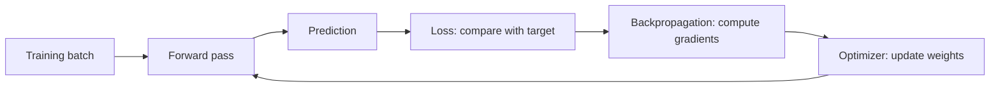
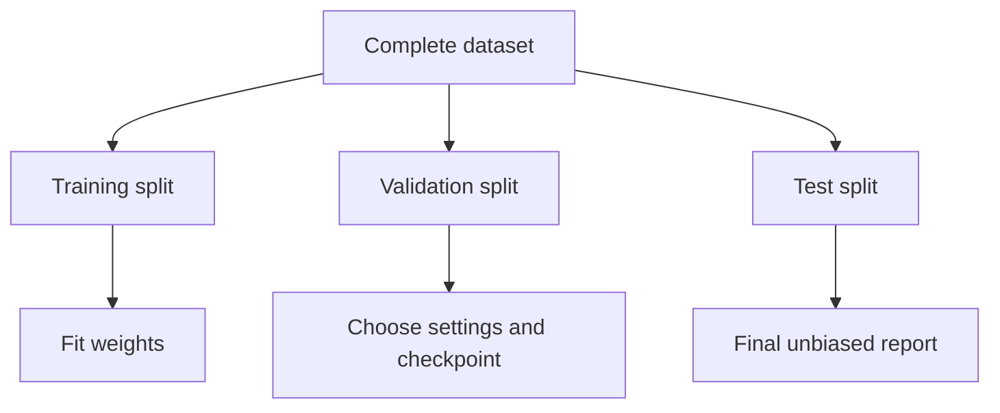
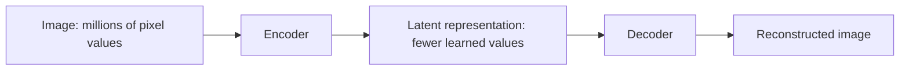
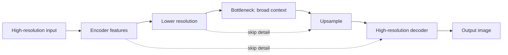
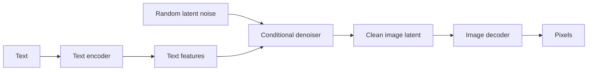
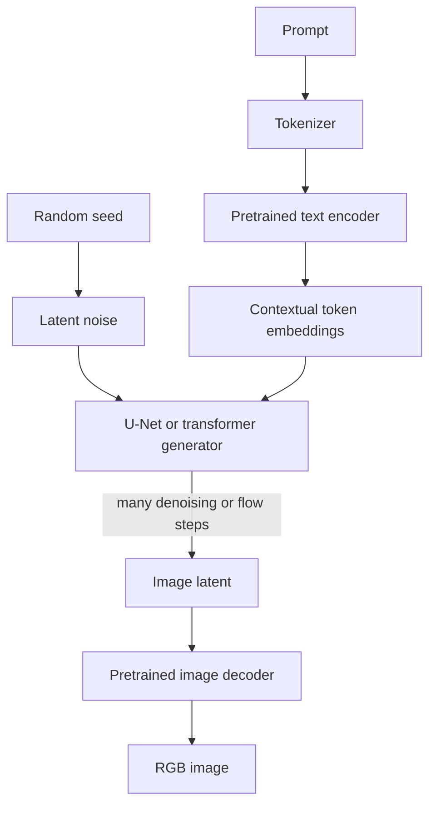
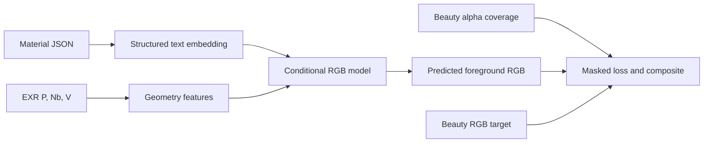
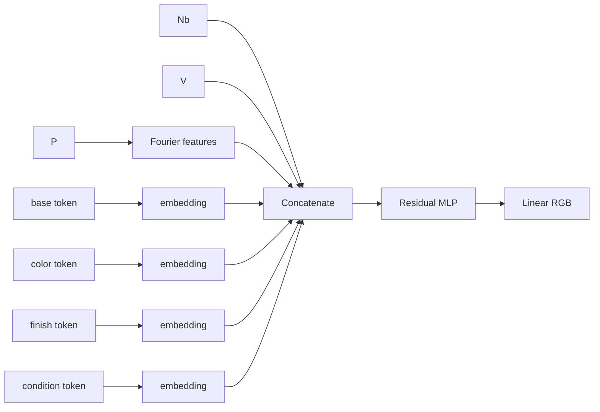

# From words to pixels: how text-conditioned image models learn

Status: **Educational guide; the Material Hero architecture near the end is a recommendation, not yet an accepted project decision**

Last reviewed: 2026-09-04

## Who this guide is for

This guide is for a technically educated computer-graphics artist who understands images, 3D geometry, shaders, and the broad idea of programming, but has not yet built or trained a neural network.

The aim is not merely to list fashionable terms. By the end, you should be able to explain:

- what a text-to-image system is actually trained to do;
- what tensors, parameters, embeddings, latent spaces, encoders, and decoders are;
- how a loss becomes a gradient and how a gradient changes a model;
- why diffusion models dominate general-purpose image generation;
- why a much simpler model is often better for a narrowly controlled problem;
- how Neuron's Material Hero can be trained from scratch on a personal computer;
- what the first experiment can prove, and what it cannot prove.

The PyTorch fragments are intentionally small. They illustrate the implementation behind the concepts; they are not a substitute for the repository's eventual tested training program.

## Contents

1. [The goal: describe an image and receive pixels](#1-the-goal-describe-an-image-and-receive-pixels)
2. [Machine learning instead of hand-authoring the function](#2-machine-learning-instead-of-hand-authoring-the-function)
3. [The basic material of deep learning: tensors](#3-the-basic-material-of-deep-learning-tensors)
4. [The training loop](#4-the-training-loop-prediction-error-correction)
5. [Training, validation, and testing](#5-training-validation-and-testing)
6. [Representations and latent space](#6-representations-and-latent-space)
7. [Turning text into conditioning](#7-turning-text-into-conditioning)
8. [Architecture families](#8-architecture-families-different-machines-for-different-uncertainty)
9. [Anatomy of a broad modern text-to-image system](#9-anatomy-of-a-broad-modern-text-to-image-system)
10. [A practical supervised workflow](#10-a-practical-supervised-image-model-workflow)
11. [Losses and metrics](#11-image-losses-metrics-and-what-they-miss)
12. [Compute and memory](#12-practical-compute-and-memory)
13. [Debugging](#13-debugging-ask-the-model-increasingly-difficult-questions)
14. [Neuron as a small generative-AI laboratory](#14-neuron-as-a-deliberately-small-generative-ai-laboratory)
15. [Recommended first Material Hero architecture](#15-recommended-first-material-hero-architecture)
16. [A minimal training loop](#16-a-minimal-training-loop-read-as-a-story)
17. [What “my own text-to-image model” can mean](#17-what-my-own-text-to-image-model-can-mean)
18. [Central lessons](#18-the-central-lessons)
19. [Glossary](#glossary)
20. [Further reading](#further-reading)

---

## 1. The goal: describe an image and receive pixels

The product-level goal sounds simple:

```text
"a red brushed metal toy"
              |
              v
        an RGB image
```

Mathematically, we want a function that maps text \(t\) to an image \(x\):

\[
x = F(t)
\]

An image is not an indivisible object to a computer. A 1024 × 1024 RGB image is an array of 3,145,728 numbers. Text is also not directly meaningful to a computer. It begins as characters or tokens that must become numbers. The model therefore learns a very large numerical transformation from one representation to another.

General text-to-image generation is harder than the equation suggests. The prompt "a red brushed metal toy" does not specify one unique image. It leaves the object's shape, pose, camera, lighting, background, brush pattern, and countless details unresolved. A useful general model must represent a **distribution of plausible images**:

\[
x \sim p(x \mid t)
\]

Read this as: “sample an image \(x\) from the distribution of images that are plausible given text \(t\).” A random seed selects one possibility from that distribution.

| Problem | Desired behavior | Typical formulation |
| --- | --- | --- |
| Classification | Choose a label | \(y = F(x)\) |
| Regression | Predict a particular value or image | \(y \approx F(x)\) |
| General text-to-image generation | Produce one of many valid images | \(x \sim p(x \mid t)\) |
| Material Hero v0 | Predict one controlled render for a prompt and fixed surface context | \(RGB = F(P,N,V,t)\) |

Material Hero deliberately turns an enormous ambiguous problem into a supervised regression problem. That is the central reason it is feasible as a personal learning project.

## 2. Machine learning instead of hand-authoring the function

A traditional renderer contains rules written by people:

```text
geometry + camera + lights + shader parameters -> rendered pixels
```

A neural renderer contains a function whose rules are mostly learned from examples:

```text
inputs -> neural network with learned weights -> predicted pixels
```

The developer chooses the broad structure—layers, connectivity, input representation, output representation, and training objective. Training discovers millions of individual numeric parameters inside that structure.

This is the difference between an **architecture** and a **trained model**:

- The architecture is the empty machine: what operations exist and how information flows.
- The parameters, or weights, are the adjustable numbers inside it.
- Training is the process that adjusts those weights.
- A checkpoint stores the learned weights and enough configuration to reconstruct the machine.
- Inference uses a checkpoint to make predictions without changing the weights.

Two models can share the same architecture but behave differently because they were trained on different data or ended with different weights.

### 2.1 What the model “knows”

A trained network does not usually contain a human-readable table saying:

```text
brushed -> anisotropic highlights
dirty   -> dark material in concavities
```

Its knowledge is distributed across numerical weights. Internal features may respond to edges, warm colors, reflectivity, words, or compositions, but the representation emerges because those features help reduce the training loss. The model is an executable statistical pattern, not a symbolic shader graph.

### 2.2 Learning is interpolation under assumptions

Machine learning works when examples have reusable structure. A network sees many input-output pairs and learns a function that behaves sensibly between or near them. Its apparent creativity comes from recombining learned structure and, in probabilistic models, sampling alternatives.

It does not automatically understand the physical world. It learns the regularities made visible by the dataset, input representation, architecture, loss, and optimization process. Change those, and you change what “good” means to the model.

---

## 3. The basic material of deep learning: tensors

A **tensor** is a multidimensional array of numbers. In everyday deep-learning code it usually means “an array with a shape and a numeric type.”

| Object | Possible tensor shape | Meaning |
| --- | --- | --- |
| RGB color | `[3]` | red, green, blue |
| RGB image | `[3, 1024, 1024]` | channel, height, width |
| Batch of eight images | `[8, 3, 1024, 1024]` | batch, channel, height, width |
| 65,536 surface samples | `[65536, 9]` | rows of `P`, `N`, and `V` |
| Token sequence | `[batch, tokens, embedding_dim]` | one vector per token |

PyTorch uses tensors for inputs, activations, weights, losses, and gradients:

```python
import torch

images = torch.zeros(2, 3, 256, 256)
surface = torch.randn(65_536, 9)  # P(3), N(3), V(3)

print(images.shape)   # torch.Size([2, 3, 256, 256])
print(surface.shape)  # torch.Size([65536, 9])
```

Shape errors are among the most common implementation problems. Annotating shapes next to equations and code is one of the highest-value habits in ML engineering.

### 3.1 A neuron and a layer

The simplest neural unit computes a weighted sum followed by a nonlinear activation:

\[
y = \sigma(w_1x_1 + w_2x_2 + \cdots + w_nx_n + b)
\]

Here \(x\) is the input, \(w\) contains learned weights, \(b\) is a learned bias, \(\sigma\) is an activation such as ReLU or SiLU, and \(y\) is the output.

A fully connected, or **linear**, layer performs many such weighted sums at once:

\[
\mathbf{y} = \sigma(W\mathbf{x} + \mathbf{b})
\]

Without nonlinear activations, stacking linear layers would still collapse into one linear transformation. Nonlinearity lets a network approximate complicated functions.

```python
from torch import nn

layer = nn.Linear(in_features=9, out_features=128)
activation = nn.SiLU()

x = torch.randn(65_536, 9)
h = activation(layer(x))
print(h.shape)  # [65536, 128]
```

The output `h` is often called an **activation**, **hidden state**, or **feature representation**.

### 3.2 Depth, width, and capacity

- Width is roughly how many features a layer carries.
- Depth is how many transformations are stacked.
- Capacity is the model's ability to represent complicated functions.

More capacity can fit more complex data, but it also costs memory and computation and can memorize the training set. Bigger is not automatically better. The smallest model that exposes the next real limitation is often the most informative experiment.

---

## 4. The training loop: prediction, error, correction



### 4.1 Forward pass and loss

The model computes a prediction:

\[
\hat{y} = F_\theta(x)
\]

The hat means “predicted,” and \(\theta\) represents every trainable parameter. A **loss function** converts the difference between prediction and target into one scalar to minimize.

Mean squared error is:

\[
\mathcal{L}_{MSE} = \frac{1}{n}\sum_{i=1}^{n}(\hat{y}_i-y_i)^2
\]

Mean absolute error, or L1 loss, is:

\[
\mathcal{L}_{L1} = \frac{1}{n}\sum_{i=1}^{n}|\hat{y}_i-y_i|
\]

MSE punishes large errors strongly and may average uncertain image details into smooth results. L1 is more robust to outliers and often preserves edges better, although no single pixel loss guarantees perceptually convincing images.

The loss is not merely a scoreboard. It is the operational definition of success. If an important quality is absent from the loss and not required indirectly by the data, the optimizer has no reason to preserve it.

### 4.2 Gradient and backpropagation

A gradient answers: “If this parameter changes slightly, which way and how strongly will the loss change?” For a parameter \(\theta_j\):

\[
\frac{\partial \mathcal{L}}{\partial \theta_j}
\]

The model is a chain of differentiable operations. The calculus chain rule lets us propagate the loss derivative backward through that chain. **Backpropagation** is the efficient algorithm that performs this bookkeeping.

PyTorch records forward operations in a computational graph and computes the derivatives automatically:

```python
x = torch.tensor([2.0])
w = torch.tensor([3.0], requires_grad=True)
target = torch.tensor([10.0])

prediction = w * x                 # 6
loss = (prediction - target) ** 2  # 16
loss.backward()

print(w.grad)  # -16
```

The negative gradient says increasing `w` would decrease the loss. PyTorch's automatic differentiation system is called **autograd**.

### 4.3 Optimizer and learning rate

The simplest update is gradient descent:

\[
\theta \leftarrow \theta - \eta \nabla_\theta \mathcal{L}
\]

\(\eta\) is the **learning rate**. Too small and training crawls; too large and it may oscillate or diverge. Adam and AdamW adapt the effective update using running estimates of gradient statistics and are common practical defaults.

```python
optimizer.zero_grad(set_to_none=True)
prediction = model(inputs)
loss = loss_fn(prediction, targets)
loss.backward()
optimizer.step()
```

`zero_grad()` matters because PyTorch accumulates gradients by default.

### 4.4 Batch, step, and epoch

- A sample is one training example.
- A batch is a group processed together.
- A step is one optimizer update.
- An epoch is one pass through the nominal training set.

For pixel-sampled training, “epoch” can become ambiguous because pixels are sampled randomly. Reporting both steps and sampled pixels is clearer.

---

## 5. Training, validation, and testing

The model must be evaluated on data it did not optimize against.



- Training data updates the weights.
- Validation data guides architecture choices, stopping, and hyperparameters.
- Test data is reserved for the final evaluation.

If you repeatedly make decisions after looking at test results, the test set quietly becomes another validation set.

### 5.1 Overfitting and generalization

**Overfitting** means the model performs much better on training examples than on unseen examples. **Generalization** is useful performance outside the exact examples used to update the weights.

Paradoxically, deliberately overfitting one example is the first essential test of a new training system. If a model cannot memorize one image, there may be a bug in the loader, alignment, model, loss, optimizer, or visualization. Only after that test passes does resistance to overfitting become interesting.

### 5.2 Split by the factor you want to generalize

Suppose one material appears from ten cameras. Randomly splitting individual frames could place nine views in training and one nearly identical view in validation. That would exaggerate generalization.

If the question is “can the model handle an unseen material?”, every view of one material must stay in the same split. If the question is “can it handle an unseen geometry?”, split by geometry. A split is part of the scientific question, not clerical housekeeping.

### 5.3 Data leakage

Leakage occurs when information unavailable in real inference sneaks into training or evaluation. Examples include:

- validation images accidentally included in training;
- a material ID that uniquely identifies the target when the intended input is descriptive text;
- normalization statistics computed from the test set;
- nearly identical frames split across train and test;
- selecting the “final” model after repeatedly inspecting test outputs.

---

## 6. Representations and latent space

Raw data is rarely the best internal language for every operation. Neural networks transform inputs through a sequence of representations.

### 6.1 Features and embeddings

A **feature** is a number or vector useful for a prediction. Some features are supplied, such as a normal vector. Others are learned. Early convolutional layers may respond to local edges and colors; later representations can combine these into larger structures.

An **embedding** maps a discrete item into a continuous vector. If the vocabulary contains `gold`, `iron`, `glass`, and `rubber`, an embedding table assigns each token a learned vector:

```python
embedding = nn.Embedding(num_embeddings=4, embedding_dim=16)
token_ids = torch.tensor([0, 2])  # gold, glass
vectors = embedding(token_ids)
print(vectors.shape)  # [2, 16]
```

The entries begin nearly random. Training moves them so they become useful. Related concepts may end up near one another, but proximity is not guaranteed to match a human semantic theory; it reflects what helps the objective.

### 6.2 What is a latent space?

**Latent** means hidden or not directly observed. A latent vector is an internal representation whose coordinates are learned rather than hand-labeled.

Imagine compressing an image into 64 numbers. No coordinate is required to mean “roughness” or “warmth,” yet movement in the latent space can change such qualities because the decoder has learned correlated structure.



A latent space is not magic storage. It is useful only because the encoder and decoder jointly learn a coordinate system that supports their objective.

### 6.3 Encoder and decoder

- An encoder converts a rich or discrete input into a compact representation.
- A decoder converts a representation into the desired output domain.

The terms describe roles, not one particular architecture. A text encoder turns tokens into contextual vectors. An image encoder compresses pixels. An image decoder expands features or latents into pixels.

### 6.4 Autoencoders and variational autoencoders

A plain autoencoder learns:

\[
z = E(x), \qquad \hat{x}=D(z)
\]

and minimizes reconstruction error between \(x\) and \(\hat{x}\).

A **variational autoencoder** (VAE) gives the latent representation a probabilistic structure. The encoder predicts a distribution—commonly a mean and variance—rather than one fixed point. A sample is decoded, and training balances reconstruction against a regularization term that encourages an organized latent distribution. The reparameterization method introduced with VAEs makes this stochastic sampling trainable with gradient methods.

VAEs are important to modern image generation because a learned image autoencoder can compress expensive pixel-space generation into a smaller latent-space problem.

### 6.5 “The latent” is ambiguous

Several latent spaces may coexist: token embeddings, a pooled prompt vector, compressed image latents, intermediate feature maps, and random noise. Always ask: latent representation of what, produced by which component, and trained for which objective?

---

## 7. Turning text into conditioning

### 7.1 Tokenization

A tokenizer breaks text into discrete units and assigns integer IDs. Units may be words, word pieces, bytes, or characters.

```text
"red brushed metal"
        |
        v
[red] [brush] [ed] [metal]
        |
        v
[183, 927, 41, 552]
```

Tokenization is not understanding. It creates an addressable vocabulary.

### 7.2 Token embeddings and context

Each token ID selects an embedding. A contextual text encoder—usually a transformer in large systems—then lets token representations influence one another. Thus “orange” can be represented differently in “orange metal” and “an orange on a table.”

The transformer's core operation is attention. In simplified form:

\[
Attention(Q,K,V)=softmax\left(\frac{QK^T}{\sqrt{d}}\right)V
\]

Queries ask what information is relevant, keys describe what is available, and values carry information combined according to the attention weights. Transformers made attention the central sequence-processing mechanism rather than an addition to recurrent networks.

### 7.3 Ways to condition an image model

**Concatenation** appends the text vector to a per-point feature:

```text
[P, N, V] + [material embedding] -> MLP -> RGB
```

**Feature-wise modulation (FiLM)** lets text predict a scale and offset for internal feature channels:

\[
FiLM(h \mid t) = \gamma(t) \odot h + \beta(t)
\]

**Cross-attention** lets image features query individual text-token features. Different image regions can attend to different words. **Adaptive normalization** uses text or timestep embeddings to control scales and shifts in normalization layers.

Concatenation and FiLM are inexpensive and suitable for a controlled vocabulary. Cross-attention is powerful for long compositional prompts, but it is unnecessary complexity for the first Material Hero model.

### 7.4 Learned tokens versus a pretrained text encoder

There are two different ambitions:

1. **Closed vocabulary:** support known concepts such as base, color, finish, and condition. Small learned embeddings are data-efficient and interpretable.
2. **Open language:** understand varied phrasing and concepts absent from the local dataset. A pretrained language-image encoder supplies broad prior knowledge but adds size, dependencies, and behavior learned elsewhere.

A dataset of 1,806 controlled renders cannot teach broad English and broad visual culture from scratch. It can teach how a deliberately defined vocabulary affects one controlled object.

---

## 8. Architecture families: different machines for different uncertainty

An architecture is a bias about how the problem is structured. There is no universally best model.

### 8.1 Multilayer perceptrons and neural fields

An **MLP** applies fully connected layers independently to each input row. For graphics, it can represent a continuous function over coordinates:

\[
color = F_\theta(position, direction, condition)
\]

This is conceptually direct, easy to train from random surface samples, modest in activation memory, resolution-independent at evaluation, and a natural match for `P`, `N`, and `V`.

Its weakness is that pixels do not communicate directly with neighbors. Global image effects are difficult unless encoded by inputs. Ordinary MLPs also learn low frequencies before fine detail, a behavior called spectral bias.

Fourier features help by mapping coordinates through sine and cosine functions at multiple frequencies:

\[
\gamma(p)=[\sin(2^0\pi p),\cos(2^0\pi p),\ldots,
\sin(2^{L-1}\pi p),\cos(2^{L-1}\pi p)]
\]

This gives the MLP easier access to high-frequency variation.

### 8.2 Convolutional neural networks

A convolution applies a learned local filter across an image. The same filter is reused at every location. This **weight sharing** makes CNNs efficient and gives them a useful image bias: nearby pixels and repeated patterns matter.

CNNs are strong for image-to-image problems, but full-resolution feature maps consume memory. They also assume similar local processing should apply across the image, which can be helpful or restrictive depending on the task.

### 8.3 U-Nets

A U-Net contracts the image to capture broad context, then expands it to recover resolution. Skip connections carry spatial detail from early layers to matching decoder layers.



U-Nets began as segmentation models and became common backbones for image translation and diffusion denoising. A text-conditioned U-Net can use concatenation, FiLM, or cross-attention.

### 8.4 Generative adversarial networks

A GAN trains two networks: a generator produces images, while a discriminator tries to distinguish real images from generated images. They play a minimax game.

GANs can create sharp images and sample quickly, but training can be unstable, evaluation is subtle, and the generator may cover only part of the data distribution—a failure called mode collapse. They are not the easiest first implementation for a small deterministic renderer.

### 8.5 Autoregressive models

An autoregressive model represents an image as a sequence and predicts the next element from previous ones:

\[
p(x)=\prod_i p(x_i \mid x_{<i})
\]

The elements might be pixels or discrete latent-image tokens. Transformers are effective sequence models, so the same broad architecture used for language can generate images token by token. Likelihood training is conceptually clean, but sequential sampling can be slow, and image tokenization introduces its own model and artifacts.

### 8.6 Diffusion models

A diffusion model learns to reverse a gradual corruption process. During training:

1. choose a real image \(x_0\);
2. choose a noise level \(t\);
3. add a known amount of Gaussian noise to obtain \(x_t\);
4. train a network to predict the noise, clean image, or an equivalent velocity target.

A common forward equation is:

\[
x_t=\sqrt{\bar{\alpha}_t}x_0+\sqrt{1-\bar{\alpha}_t}\epsilon,
\qquad \epsilon\sim\mathcal{N}(0,I)
\]

One common objective predicts the added noise:

\[
\mathcal{L}_{diff}=\mathbb{E}\left[\|\epsilon-\epsilon_\theta(x_t,t,c)\|^2\right]
\]

where \(c\) is conditioning such as text.

At inference, generation starts from random noise and repeatedly applies the learned denoising direction. The random starting point gives multiple valid images for the same prompt.

Diffusion is attractive because denoising regression is stable and covers complex distributions well. Its costs are repeated network evaluations, substantial training data, and more machinery than direct regression.

### 8.7 Latent diffusion

Pixel-space diffusion is expensive. Latent diffusion first trains or adopts an image autoencoder:



The diffusion process operates on compressed spatial latents rather than full pixels. This reduces cost while retaining a decoder capable of producing high-resolution detail. Cross-attention commonly connects text features to the denoiser.

### 8.8 Diffusion transformers and flow matching

The denoising backbone need not be a U-Net. A Diffusion Transformer (DiT) processes latent image patches with transformer blocks. This design scales predictably with model compute and is common in large modern systems.

**Flow matching** learns a time-dependent vector field that transports samples from a simple distribution, such as noise, toward the data distribution. Generation numerically follows the learned flow. Diffusion paths are one possible family of probability paths; other paths may permit more efficient sampling.

At a high level:

```text
diffusion:     learn how to denoise along a noisy path
flow matching: learn the velocity field along a probability path
```

The engineering details differ, but both learn a conditional distribution and turn noise into data. Neither eliminates the need for representative data, a good conditioning representation, and careful evaluation.

### 8.9 Fine-tuning a foundation model

Training a broad text-to-image model from scratch requires enormous image-text diversity and compute. A practical alternative is to adapt a pretrained model.

- Full fine-tuning updates most or all weights and is expensive.
- LoRA learns small low-rank weight updates and can fit on consumer hardware.
- Textual inversion learns one or a few token embeddings.
- Adapters add compact conditioning modules.

This can produce a personal, customized image generator, but most of its visual knowledge was learned during external pretraining. It answers a different educational question from building a complete small system from first principles.

### 8.10 Choosing among the families

| Situation | Sensible starting point | Why |
| --- | --- | --- |
| One deterministic target per controlled input | Direct MLP or CNN regression | No need to learn a sampling distribution |
| Image-to-image mapping with spatial context | U-Net or encoder-decoder CNN | Strong locality and multiscale structure |
| Diverse outputs for the same condition | Diffusion or flow model | Explicit stochastic sampling |
| Broad language and visual concepts | Pretrained foundation model | Local data cannot teach the world |
| Very fast sharp sampling with expert tuning | GAN | One-pass generation, but harder training |
| Images represented as discrete tokens | Autoregressive transformer | Natural likelihood formulation |

Modern does not mean appropriate. Architecture should follow the uncertainty and structure of the actual task.

---

## 9. Anatomy of a broad modern text-to-image system



During training, an image encoder converts real images into latents, and the generator learns the diffusion or flow objective there. During ordinary inference, there is no real input image to encode: the process starts from noise, guided by text, and the decoder converts the result to pixels.

### 9.1 Where the “understanding” lives

It is distributed:

- the tokenizer defines the text units;
- the text encoder supplies language representations;
- the generator learns relationships between language and visual structure;
- the image autoencoder defines which pixel details survive in latent space;
- the training corpus supplies concepts, biases, styles, and associations;
- guidance and sampling determine how a particular result is drawn.

There is no single “imagination module.”

### 9.2 Classifier-free guidance

Conditional diffusion models are often trained both with and without conditioning. At sampling time, the conditional and unconditional predictions can be combined to strengthen prompt adherence:

\[
\hat{\epsilon}=\epsilon_{uncond}+s(\epsilon_{cond}-\epsilon_{uncond})
\]

The guidance scale \(s\) trades diversity and naturalness against stronger conditioning. Very high guidance can create artifacts or exaggerated images.

### 9.3 Why broad systems are expensive

They must learn or inherit natural-language variation, objects, anatomy, environments, composition, perspective, styles, cultural concepts, and a huge image distribution. They also need enough capacity to generate high-resolution detail. The apparent simplicity of a prompt box hides multiple large models and the accumulated cost of internet-scale pretraining.

---

## 10. A practical supervised image-model workflow

### 10.1 Define the contract

Write down the exact inputs and coordinate systems, target and color space, valid ranges, normalization, variable and fixed factors, supported inference conditions, split unit, and success metrics. An attractive training curve cannot rescue an ambiguous contract.

### 10.2 Inspect before training

For image and EXR data, verify dimensions, channel names, numeric types and ranges, finite values, alpha meaning, prompt-target agreement, camera/geometry alignment, and representative bright, dark, reflective, and transparent cases.

Visualize every input buffer. A normal convention error can still produce a decreasing loss while silently teaching the wrong relationship.

### 10.3 Freeze each experiment's inventory

If rendering continues while training code is developed, scan available files once at run start and save the exact sample IDs with the experiment. Do not let examples appear halfway through an epoch. A changing dataset makes comparisons difficult to reproduce.

This experiment inventory is not a requirement for the render dataset itself; it is training-run state.

### 10.4 Normalize inputs

Neural networks usually optimize more easily when input magnitudes are comparable.

- Unit normals and unit view directions should be renormalized after filtering.
- Positions can use bounds computed from the training geometry or another documented fixed convention.
- RGB must preserve the documented color space. Do not train accidentally on a tone-mapped preview when the contract says linear EXR.
- Statistics used for normalization must come from training data only.

### 10.5 Start with trivial baselines

Useful baselines predict the average image, choose the nearest training material, ignore text, or ignore geometry. Without baselines, “the result looks plausible” tells little about what the model learned.

### 10.6 Overfit in increasing circles

1. One batch.
2. One material.
3. The eight-material stress set.
4. A small, balanced subset.
5. The full training split.

At each stage, save predicted-versus-target images. Loss numbers alone do not expose color transforms, channel swaps, silhouette problems, or spatial blur.

### 10.7 Track experiments

At minimum save the code revision, dataset version and sample IDs, split assignment, seed, model configuration, optimizer, learning rate, loss, checkpoint, validation metrics, and a fixed qualitative grid.

Reproducibility does not require a large platform. A JSON configuration and disciplined output folder are enough for a small project.

---

## 11. Image losses, metrics, and what they miss

### 11.1 Masked foreground loss

If the model predicts only the object, background pixels should not dominate the average. With coverage \(a_i\):

\[
\mathcal{L}_{fg}=
\frac{\sum_i a_i\lVert\hat{c}_i-c_i\rVert_1}
{\sum_i a_i+\varepsilon}
\]

Fractional antialiased coverage can weight silhouette pixels rather than making a hard binary cut.

```python
import torch.nn.functional as F

def masked_l1(pred_rgb, target_rgb, coverage):
    error = (pred_rgb - target_rgb).abs()
    weighted = error * coverage
    return weighted.sum() / (coverage.sum() * 3 + 1e-8)
```

### 11.2 Pixel, structural, and perceptual losses

- L1 and MSE compare corresponding numeric pixels.
- Charbonnier loss is a smooth robust alternative to L1.
- Gradient loss compares horizontal and vertical image derivatives and can encourage edge fidelity.
- SSIM compares local structure and contrast.
- Perceptual loss compares features from a pretrained image network.
- Adversarial loss asks a discriminator whether outputs look real.

Each adds assumptions. A perceptual network trained on ordinary photographs may not measure linear HDR render fidelity in the way the project needs. Begin with a loss whose behavior is easy to explain, then add complexity in response to a visible failure.

### 11.3 PSNR, SSIM, LPIPS, and human judgment

PSNR is derived from MSE and rewards exact pixels. SSIM focuses more on local structure. LPIPS uses deep features to approximate perceptual similarity. None alone answers “does the material look brushed, dirty, metallic, or glass-like?”

For a material model, evaluation should include:

- numeric reconstruction error;
- fixed prompt grids;
- attribute checks for base, color, finish, and condition;
- held-out material IDs;
- held-out combinations of familiar attributes;
- prompt-agnostic and nearest-material baselines;
- unsupported views clearly labeled as out of distribution.

### 11.4 Training loss is not validation loss

If training loss keeps falling while validation loss rises, the model is memorizing training-specific detail. If both remain high, the model may be too small, badly optimized, fed incorrect inputs, or solving an impossible mapping. If the metrics look good but images look wrong, inspect color processing, masks, averaging, and whether the metric values the same thing a viewer does.

---

## 12. Practical compute and memory

### 12.1 Parameters are not the whole memory cost

Training memory contains:

- model parameters;
- gradients;
- optimizer state;
- saved activations needed for backpropagation;
- input and target batches;
- temporary workspaces.

For a full-resolution CNN, activations often dominate. A feature tensor with shape `[8, 128, 512, 512]` contains over 268 million values. In float32 that tensor alone is roughly 1 GiB, before its gradients and neighboring layers.

A per-point MLP can instead sample perhaps 65,536 visible points per step. It still learns from 1024 × 1024 source images, but it does not keep a pyramid of full-resolution feature maps in memory.

### 12.2 Mixed precision

Modern GPUs can run many operations using 16-bit numbers while preserving sensitive operations in 32-bit precision. PyTorch automatic mixed precision uses autocasting and gradient scaling:

```python
scaler = torch.amp.GradScaler("cuda")

optimizer.zero_grad(set_to_none=True)
with torch.autocast(device_type="cuda", dtype=torch.float16):
    prediction = model(inputs)
    loss = loss_fn(prediction, targets)

scaler.scale(loss).backward()
scaler.step(optimizer)
scaler.update()
```

Mixed precision reduces activation memory and can increase throughput. It does not fix an architecture whose full-resolution tensors fundamentally exceed GPU memory.

### 12.3 Batch size and gradient accumulation

A larger batch averages gradients over more examples but uses more memory. **Gradient accumulation** processes several small microbatches before the optimizer step, approximating a larger batch. It does not reduce total computation, but it can fit the work into memory.

### 12.4 Data loading can become the bottleneck

Multipart 1024 × 1024 EXRs are large. Training may wait for disk decompression rather than the GPU. Measure before building a cache. Reasonable incremental responses are:

1. load EXRs directly and profile;
2. cache the repeatedly used geometry buffers in RAM;
3. prepare a training-only cache if I/O demonstrably dominates;
4. retain EXRs as the authoritative dataset.

Optimization should follow evidence.

### 12.5 The laptop constraint

An NVIDIA RTX A1000 with 8 GB VRAM and 32 GB system RAM is suitable for small MLPs, modest CNNs, pixel or patch sampling, mixed precision, and small controlled experiments. It is not a realistic platform for training a competitive general-purpose text-to-image foundation model from scratch.

That is not a disappointing compromise. It creates a setting in which the whole training system can be understood rather than hidden behind a giant pretrained artifact.

---

## 13. Debugging: ask the model increasingly difficult questions

Use this order because each stage isolates a different class of failure.

### 13.1 Can the loader reproduce the source?

Read one EXR, write preview images for every channel, reconstruct the prompt lookup, and report numeric ranges. No model is involved.

### 13.2 Can the model overfit one fixed batch?

Use the same samples repeatedly. Loss should fall dramatically and the prediction should resemble the target. Failure points to implementation or capacity, not generalization.

### 13.3 Does text matter?

Hold geometry constant and change the prompt. Shuffle prompt-target pairings as a negative control. Compare with a prompt-agnostic model. If results barely change, the network may be ignoring conditioning.

### 13.4 Do embeddings compose?

Hold three attributes fixed while changing one:

```text
gold polished clean
gold brushed clean
gold matte clean
```

Then test combinations absent from training. This distinguishes useful attribute learning from memorizing complete material IDs.

### 13.5 Does geometry matter?

For fixed-view v0, `P`, `N`, and `V` are nearly the same across every material. A model can learn to ignore them because they do not explain variation between examples. This is expected, not proof of a bug.

Geometry conditioning becomes testable when camera or geometry varies. Until then, compare with an ablation that removes those buffers and describe the conclusion honestly.

### 13.6 Common symptoms

| Symptom | Likely questions |
| --- | --- |
| Constant average-colored output | Is text connected? Is the learning rate useful? Is the loss dominated by background? |
| Correct shape, wrong colors | Is linear RGB being displayed as sRGB? Are channels ordered correctly? |
| Sparkling or broken silhouettes | Is coverage aligned? Are filtered normals and view vectors renormalized? |
| Training loss falls, validation stalls | Is the model memorizing material IDs or spatial detail? |
| Fine patterns disappear | Does the MLP need Fourier features, or does the loss average uncertain detail? |
| Glass and reflections fail | Is the mapping nonlocal or missing information? |
| Different prompts look identical | Are embeddings receiving gradients? Is the data lookup correct? |
| NaN loss | Are EXRs finite? Is normalization safe? Is mixed precision overflowing? |

---

## 14. Neuron as a deliberately small generative-AI laboratory

### 14.1 The unconstrained dream and the tractable experiment

The dream is a personal system like a broad text-to-image service:

```text
arbitrary language -> arbitrary high-quality image
```

Training that system from scratch would require broad language knowledge, a huge and diverse image-text corpus, large models, substantial compute, and difficult evaluation. Reducing the network size alone would not solve the missing-data problem.

Material Hero asks a narrower question:

> Can a model learn the rendered appearance of one known object, under one known camera and lighting setup, when the changing factor is a controlled material description?

The fixed factors are:

- one Sculpted Rubber Toy geometry;
- one camera in dataset v0;
- one studio-lighting and color-management setup;
- one geometry transform and scale;
- one deterministic appearance per material record.

The variable factors are:

- material base;
- optional color;
- finish;
- condition.

This removes pose generation, composition, geometry generation, lighting design, open-language understanding, and stochastic choice from the first learning problem.

### 14.2 The supervised contract

Each rendered material supplies aligned data:

| Symbol | Dataset channel | Meaning |
| --- | --- | --- |
| \(P\) | `P` | world-space visible surface position |
| \(N\) | `Nb` | smooth, unbumped world-space normal |
| \(V\) | `V` | normalized direction from surface toward camera |
| \(A\) | `C.A` | material-independent geometry coverage |
| \(C\) | `C.RGB` | target linear rendered color |
| \(t\) | JSON metadata/label | material description |

The desired function is:

\[
\hat{C}=F_\theta(P,N,V,t)
\]

Coverage travels beside the model as the loss mask and display-compositing mask. The network only needs to predict foreground RGB.



### 14.3 Why this still counts as generative AI

The trained model creates pixels from a semantic condition rather than selecting an existing render. It can combine learned factors and eventually operate on rasterized surface buffers from the web application.

However, v0 is **deterministic conditional generation**, not an open-ended probabilistic image model. Given the same prompt and buffers, it should return the same image. It has no noise input and is not trained to represent multiple valid outcomes for one prompt.

This is an advantage for learning: every error has a known target, the model can be small, and the relationship between data and output is visible.

### 14.4 What the first dataset can and cannot teach

It can teach:

- how controlled material words correlate with rendered appearance;
- the fixed object's spatial appearance under the fixed light;
- color, broad reflectance, dirt, wear, and procedural patterns represented in the targets;
- interpolation and composition among attributes, if splits and data support it.

It cannot establish:

- arbitrary-camera rendering;
- arbitrary-geometry transfer;
- relighting;
- free-form English understanding;
- multiple creative images per prompt;
- editable PBR parameters;
- physical correctness outside the observed data.

Because `P`, `N`, and `V` are essentially constant across v0 materials, a successful v0 network may memorize the fixed image domain and partially ignore geometry inputs. Multi-view and multi-geometry releases are what make those inputs statistically necessary.

---

## 15. Recommended first Material Hero architecture

This section is a **proposal for the first experiment**, not an accepted architecture decision.

### 15.1 Recommendation in one sentence

Train a small coordinate-conditioned residual MLP that combines Fourier-encoded position, raw normalized normal and view direction, and separate learned embeddings for base, color, finish, and condition, then predicts linear foreground RGB per visible surface sample.



### 15.2 Why this is the right first architecture

It matches the project's equation directly. It trains on randomly sampled visible pixels rather than full image pyramids, so 1024 × 1024 source data does not imply 1024 × 1024 CNN activation memory. It uses only concepts that can be inspected: embeddings, Fourier features, linear layers, nonlinearities, residual connections, and an RGB loss.

It is also a strong scientific baseline. If it works, the project has proven the data path with a compact model. If it fails specifically on glass, reflections, shadows, or spatial patterns, that failure motivates an image-space model instead of assuming one is needed.

It is preferred over diffusion because the current dataset has one intended output for each condition. Adding a random denoising process would spend compute learning a distribution that the dataset does not actually demonstrate.

### 15.3 Proposed dimensions

| Component | Initial value | Purpose |
| --- | ---: | --- |
| Base embedding | 16 values | base-material semantics |
| Color embedding | 16 values | color or a learned `<none>` token |
| Finish embedding | 16 values | polished, matte, brushed, and so on |
| Condition embedding | 16 values | clean, dusty, scratched, and so on |
| Position Fourier bands | 6 | access to spatial detail at several frequencies |
| MLP width | 256 | modest capacity |
| Residual blocks | 6 | depth without difficult gradient flow |
| Output | 3 unconstrained values | linear RGB, including values above 1 |

This is roughly a million-parameter class of model, depending on the exact block design and vocabulary sizes. That is tiny beside a foundation model and large enough to run a meaningful first test.

Do not feed the complete material ID as a learned token. It would make memorization easy while bypassing the intended compositional meaning of base, color, finish, and condition.

### 15.4 What is the latent space in this model?

There is no compressed image latent and no VAE. The learned material embeddings are small semantic latent vectors. After concatenation, the 256-wide hidden activations are per-surface latent features. The MLP acts as the decoder from those features to RGB.

This is useful terminology discipline:

```text
structured tokens -> semantic embeddings
P/N/V + embeddings -> hidden per-point representation
hidden representation -> RGB
```

Not every generative model needs a separate encoder-decoder autoencoder.

### 15.5 Compact PyTorch sketch

The following omits configuration loading and validation so the architecture remains visible:

```python
import math
import torch
from torch import nn


def fourier_position(p, bands=6):
    """p: [B, N, 3], normalized to a documented fixed range."""
    frequencies = (2.0 ** torch.arange(
        bands, device=p.device, dtype=p.dtype
    )) * math.pi
    angles = p[..., None] * frequencies  # [B, N, 3, bands]
    return torch.cat(
        [p, angles.sin().flatten(-2), angles.cos().flatten(-2)],
        dim=-1,
    )


class MaterialEncoder(nn.Module):
    def __init__(self, vocabulary_sizes, embedding_dim=16):
        super().__init__()
        self.names = ("base", "color", "finish", "condition")
        self.tables = nn.ModuleDict({
            name: nn.Embedding(vocabulary_sizes[name], embedding_dim)
            for name in self.names
        })

    def forward(self, token_ids):
        # Each token_ids[name] has shape [B].
        return torch.cat(
            [self.tables[name](token_ids[name]) for name in self.names],
            dim=-1,
        )  # [B, 64]


class ResidualBlock(nn.Module):
    def __init__(self, width):
        super().__init__()
        self.net = nn.Sequential(
            nn.LayerNorm(width),
            nn.Linear(width, width),
            nn.SiLU(),
            nn.Linear(width, width),
        )

    def forward(self, x):
        return x + self.net(x)


class MaterialHeroMLP(nn.Module):
    def __init__(self, vocabulary_sizes, bands=6, width=256, blocks=6):
        super().__init__()
        self.bands = bands
        self.text = MaterialEncoder(vocabulary_sizes)

        position_dim = 3 + 2 * 3 * bands
        geometry_dim = position_dim + 3 + 3  # encoded P + N + V
        text_dim = 4 * 16

        self.input = nn.Sequential(
            nn.Linear(geometry_dim + text_dim, width),
            nn.SiLU(),
        )
        self.blocks = nn.Sequential(
            *[ResidualBlock(width) for _ in range(blocks)]
        )
        self.output = nn.Linear(width, 3)

    def forward(self, p, n, v, token_ids):
        # p, n, v: [B, N, 3]
        geometry = torch.cat([fourier_position(p, self.bands), n, v], -1)
        material = self.text(token_ids)  # [B, 64]
        material = material[:, None, :].expand(-1, p.shape[1], -1)

        h = self.input(torch.cat([geometry, material], dim=-1))
        h = self.blocks(h)
        return self.output(h)  # [B, N, 3], linear RGB
```

The model output is not passed through a sigmoid because linear render values may exceed 1. Display transforms and tone mapping belong to visualization, not silently inside the training target.

### 15.6 Input preparation

For each optimizer step:

1. choose material records uniformly;
2. load their aligned EXR channels and structured metadata;
3. identify pixels with nonzero coverage;
4. sample visible pixels;
5. gather `P`, `Nb`, `V`, coverage, and target RGB at those indices;
6. normalize `P` using a frozen training convention;
7. renormalize `Nb` and `V` to unit length;
8. map material fields to vocabulary IDs;
9. run the model and compute coverage-weighted foreground loss.

Choosing materials uniformly is important. Sampling blindly from all pixels could overrepresent whichever files are loaded or cached most often.

### 15.7 Recommended first loss

Begin with coverage-weighted L1 in documented linear RGB:

\[
\mathcal{L}=
\frac{\sum_i A_i\lVert F_\theta(P_i,N_i,V_i,t)-C_i\rVert_1}
{3\sum_i A_i+\varepsilon}
\]

Keep the output and target unclipped during loss computation. If rare HDR highlights destabilize training, inspect their real distribution before choosing a documented scaling or robust representation. Do not fix the issue by accidentally clipping the ground truth to display range.

Only add a small gradient or multiscale image loss if full-frame validation shows spatial softness that pixel L1 cannot address. A randomly sampled point model cannot compute neighboring-image gradient loss unless the batch includes structured patches, so that addition would also change the sampler.

### 15.8 Concrete starting configuration

- Optimizer: AdamW.
- Learning rate: `1e-3` for the initial MLP experiments.
- Weight decay: small, for example `1e-6`.
- Precision: PyTorch automatic mixed precision on CUDA.
- Material batch: begin with 4 materials per step.
- Pixel samples: begin with 16,384 visible samples per material, or 65,536 total.
- Validation: render complete frames in chunks so inference does not require all points at once.
- Randomness: store Python, NumPy, PyTorch, sampling, and split seeds.
- Checkpoints: save the latest state and the state with best validation loss.

These are starting coordinates, not sacred constants. Measure throughput and memory, then change one important variable at a time.

### 15.9 Recommended split

Create the split from all 1,806 production material records before considering which renders happen to be complete:

- about 80% training material IDs;
- about 10% validation material IDs, stratified across major attributes;
- about 10% compositional test IDs chosen so selected base/finish/condition combinations are absent from training even though their individual tokens are present.

Every future camera view of a material must inherit that material's split. Store the split with the training experiment, not in the Houdini render dataset.

Partial renders are suitable for loader development and deliberate overfitting. They are not suitable for the final validation claim because render order may create a biased subset.

### 15.10 Training sequence

#### Stage 0: loader and visualization

The loader must reproduce source buffers and prompts exactly. Report channel ranges and finite-value checks. Save viewable images for RGB, coverage, position, normal, and view direction.

#### Stage 1: one-material overfit

Train on one material until the model reconstructs it closely. Use one fixed batch first, then random pixels from that image. This proves forward pass, loss, backward pass, optimizer, and full-frame assembly.

#### Stage 2: eight-material stress overfit

Use the existing stress materials. Hold geometry constant and build prompt grids. Confirm that changing base, finish, and condition changes the output.

Train a prompt-agnostic copy with the same approximate capacity. The conditioned model should do materially better.

#### Stage 3: small balanced subset

Choose enough examples to cover every token several times. Evaluate unseen material IDs and at least a few unseen combinations. This is where embedding composition first becomes meaningful.

#### Stage 4: complete v0 training

After the render finishes and dataset QA passes, freeze sample inventory and splits, train on the full training split, select checkpoints on validation only, and run the compositional test once the approach is settled.

#### Stage 5: web reference-view inference

Rasterize matching `P`, `N`, `V`, and Coverage buffers from the exported hero mesh. Predict RGB in chunks, assemble it into the image, composite using Coverage, and apply the proper display transform.

Only after the training-camera reference works should orbit, zoom, and alternate meshes be treated as experiments.

### 15.11 What to try if the MLP fails

Failures should select the next architecture:

| Observed failure | Next experiment |
| --- | --- |
| MLP cannot fit one material | Fix pipeline or increase basic capacity; do not change families yet |
| Coarse appearance works but fine detail is missing | Tune Fourier bands or sample spatial patches |
| Local shading works but glass/reflections fail | Try a compact image-space model with broader context |
| Neighboring pixels are inconsistent | Try a FiLM-conditioned U-Net |
| Controlled synonyms are required | Add a small pretrained text encoder or explicit synonym mapping |
| Multiple plausible outputs per prompt are required | Add a noise variable and only then consider conditional diffusion or flow |

The recommended second architecture is a compact FiLM-conditioned U-Net. It would receive rasterized `P`, `N`, `V`, and Coverage as image channels and use the same structured material embedding to modulate feature blocks. Begin at 256 × 256 or with patches, because full-resolution U-Net activations are much more expensive than MLP samples on an 8 GB GPU.

Do not jump directly from an imperfect MLP to latent diffusion. First determine whether the missing capability is spatial context, text representation, data coverage, or genuine output ambiguity.

### 15.12 Why not predict shader parameters?

Predicting a small PBR parameter vector would be computationally easier, but it would answer a different question. Material Hero intentionally learns final rendered RGB appearance, including behavior produced by procedural variation, dirt, wear, bump, lighting, and the fixed scene.

The cost is that the result is not an editable or relightable material. This tradeoff is part of the project definition, not an accident.

### 15.13 Why include geometry buffers if v0 can ignore them?

They establish the interface for later experiments:

```text
v0: one view, one geometry
    -> establish exact-view material learning

v1: multiple views, one geometry
    -> V and changing visible P/N become informative

v2: multiple views, multiple geometries
    -> geometry context becomes essential
```

Keeping the logical contract stable makes later comparisons cleaner. The v0 ablation should still measure whether geometry inputs affect results rather than assuming they do.

### 15.14 One training example, end to end

Consider `gold brushed dirty`. The JSON record provides categorical fields such as base=`gold`, finish=`brushed`, condition=`dirty`, and color=`<none>`.

For one visible pixel, the loader might assemble:

```text
P        = [ 0.18,  0.72, -0.31]
N        = [ 0.42,  0.35,  0.84]
V        = [-0.21,  0.10,  0.97]
coverage = 1.00
tokens   = [gold, <none>, brushed, dirty]
target   = [2.10, 1.34, 0.42]  # illustrative linear RGB
```

The token IDs select four learned embedding vectors. Fourier functions expand `P`. The model concatenates those features with `N` and `V`, transforms them through its hidden layers, and predicts three RGB values.

Suppose the prediction is `[1.80, 1.20, 0.55]`. The loss measures its difference from the target. Backpropagation attributes pieces of that error to every used weight—including the gold, brushed, and dirty embeddings. AdamW nudges those weights. The next sampled pixel provides another correction. Millions of such small corrections produce the trained function.

The network is not shown “goldness” directly. It discovers a representation of `gold` that is useful across all gold examples and, ideally, composes with several finishes and conditions.

---

## 16. A minimal training loop, read as a story

This example shows the shape of implementation without the EXR-specific loader:

```python
device = torch.device("cuda")
model = MaterialHeroMLP(vocabulary_sizes).to(device)
optimizer = torch.optim.AdamW(
    model.parameters(), lr=1e-3, weight_decay=1e-6
)
scaler = torch.amp.GradScaler("cuda")

for step, batch in enumerate(train_loader):
    p = batch["P"].to(device)             # [B, N, 3]
    n = batch["N"].to(device)             # [B, N, 3]
    v = batch["V"].to(device)             # [B, N, 3]
    rgb = batch["rgb"].to(device)         # [B, N, 3]
    coverage = batch["coverage"].to(device)  # [B, N, 1]
    tokens = {
        name: values.to(device)
        for name, values in batch["tokens"].items()
    }

    optimizer.zero_grad(set_to_none=True)

    with torch.autocast(device_type="cuda", dtype=torch.float16):
        prediction = model(p, n, v, tokens)
        loss = masked_l1(prediction, rgb, coverage)

    scaler.scale(loss).backward()
    scaler.step(optimizer)
    scaler.update()

    if step % 100 == 0:
        print(step, float(loss))
```

Read it from top to bottom:

1. Create the model—the architecture with initially random weights.
2. Create the optimizer—the rule that will modify those weights.
3. Receive one batch of surface samples and material tokens.
4. Clear gradients left from the previous step.
5. Run the forward pass under mixed precision.
6. Compare predicted and true foreground RGB.
7. Backpropagate to compute every parameter's gradient.
8. Let AdamW update the parameters.
9. Repeat many times.

Inference removes the loss, backward pass, and optimizer step:

```python
model.eval()
with torch.inference_mode(), torch.autocast("cuda", dtype=torch.float16):
    prediction = model(p, n, v, tokens)
```

Training changes the model. Inference uses it.

---

## 17. What “my own text-to-image model” can mean

There are at least three valid goals:

### 17.1 Build a broad generator from scratch

You own and train the complete stack, but the data and compute requirements are far beyond a normal laptop if the goal is competitive general-purpose quality.

### 17.2 Fine-tune a broad pretrained generator

You can obtain impressive open-ended images on consumer hardware using LoRA or another adapter. You own the customization, experiment, and workflow, but the model's broad visual knowledge comes from someone else's pretraining.

### 17.3 Build a narrow complete generator from scratch

You constrain the visual world enough to train every task-specific weight yourself. The output domain is smaller, but the full chain from dataset through model to application is understandable and inspectable.

Material Hero chooses the third path. It is not a miniature general image generator; it is a complete laboratory for the same fundamental ingredients:

- paired data;
- numeric representations;
- text conditioning;
- learned embeddings;
- differentiable prediction;
- loss and backpropagation;
- held-out evaluation;
- checkpointed inference;
- progressive expansion of the data distribution.

This is an honest route toward deeper understanding. After completing it, terms such as encoder, latent, conditioning, diffusion, and generalization refer to mechanisms you have implemented or compared, not merely interface labels.

## 18. The central lessons

1. **The dataset defines the world the model can learn.** An architecture cannot infer variations never demonstrated or supplied by pretraining.
2. **A prompt is not meaning until it has a representation.** Controlled embeddings and pretrained text encoders solve different problems.
3. **A latent space is an internal coordinate system, not magic.** Always identify what it represents and how it was trained.
4. **Training is repeated numerical correction.** Forward pass, scalar loss, backpropagated gradients, optimizer update.
5. **General generation and deterministic regression are different tasks.** Noise-based models are valuable when multiple outputs are actually desired and represented.
6. **Splits encode the scientific question.** Split by material, camera, or geometry according to the generalization claim.
7. **The smallest useful model is often the best first experiment.** It exposes data and reasoning errors quickly.
8. **Good-looking output is not enough.** Use baselines, ablations, held-out data, and fixed qualitative comparisons.
9. **Scope is an engineering tool.** Fixing geometry, camera, and light makes it possible to own the whole learning system.
10. **Expansion should follow measured failure.** Add spatial context, views, geometries, open language, or stochasticity one justified step at a time.

---

## Glossary

**Activation**  
The output of a neuron or layer after its transformation and usually a nonlinearity.

**Adam / AdamW**  
Optimizers that adapt updates using running gradient statistics. AdamW separates weight decay from the adaptive update.

**Architecture**  
The designed structure of a model: layers, connections, representations, and data flow.

**Attention**  
A mechanism that lets one set of features weight and combine information from another set. Self-attention operates within one sequence; cross-attention connects different sources such as image and text.

**Autograd**  
PyTorch's automatic differentiation system.

**Autoregressive model**  
A model that predicts each sequence element conditioned on preceding elements.

**Backpropagation**  
The algorithm that applies the chain rule backward through a computational graph to compute parameter gradients.

**Batch**  
A collection of samples processed together for one forward and backward pass.

**Checkpoint**  
A saved training state, usually including model weights and often optimizer, scheduler, step, and configuration.

**Classifier-free guidance**  
A sampling method that combines conditional and unconditional model predictions to strengthen conditioning.

**CNN**  
Convolutional neural network; an architecture using spatially shared local filters.

**Conditioning**  
Information supplied to control a model's output, such as text, class, camera, depth, normals, or another image.

**Convolution**  
A learned local filtering operation reused across spatial positions.

**Coverage**  
In this project, the material-independent fraction of a pixel occupied by visible geometry, stored in Beauty alpha.

**Data leakage**  
Information from validation/test targets or otherwise unavailable inference data entering training or model selection.

**Dataset**  
The examples and metadata from which a model learns and on which it is evaluated.

**Decoder**  
A component that maps an internal representation into an output such as text, pixels, or audio.

**Diffusion model**  
A generative model trained to reverse progressive noise corruption.

**Embedding**  
A learned continuous vector representing a discrete item such as a token or category.

**Encoder**  
A component that converts input into an internal representation.

**Epoch**  
One nominal pass through a training dataset.

**Feature**  
A supplied or learned numeric value useful to the model.

**FiLM**  
Feature-wise Linear Modulation; conditioning that scales and shifts feature channels.

**Fine-tuning**  
Continuing training from pretrained weights for a new dataset or behavior.

**Flow matching**  
A generative approach that learns a time-dependent vector field transporting a simple distribution toward the data distribution.

**Fourier features**  
Sine and cosine encodings that help networks represent high-frequency functions of coordinates.

**Foundation model**  
A large broadly pretrained model intended for adaptation or many downstream uses.

**Forward pass**  
Computing a model's prediction from its inputs.

**GAN**  
Generative adversarial network; a generator trained against a discriminator.

**Generalization**  
Useful performance on examples or conditions not used to fit the weights.

**Gradient**  
The derivative of a scalar objective with respect to parameters or inputs.

**Gradient accumulation**  
Summing gradients across microbatches before an optimizer update to simulate a larger batch.

**Hyperparameter**  
A setting chosen outside ordinary gradient training, such as learning rate, width, or batch size.

**Inference**  
Using a trained model to produce outputs without updating its weights.

**Latent space**  
A learned internal representation space whose coordinates are not directly observed labels.

**Learning rate**  
The scale of parameter updates made by the optimizer.

**Linear RGB**  
RGB values proportional to scene or display light rather than gamma-encoded display values.

**LoRA**  
Low-Rank Adaptation; a parameter-efficient method that learns small low-rank updates to selected pretrained weights.

**Loss function**  
A differentiable scalar measuring how wrong a prediction is under the training objective.

**MLP**  
Multilayer perceptron; a stack of fully connected layers and nonlinearities.

**Mixed precision**  
Using lower-precision arithmetic where safe and higher precision where needed to improve memory use and speed.

**Mode collapse**  
A GAN failure in which the generator produces only a limited subset of the data distribution.

**Model**  
Depending on context, the architecture plus current parameters, or the trained artifact as a whole.

**Normalization**  
Transforming numeric ranges or feature statistics into a more suitable training representation. Also used for specific neural-network layers; context matters.

**Optimizer**  
The algorithm that converts gradients into parameter updates.

**Overfitting**  
Fitting training examples much better than unseen examples.

**Parameter / weight**  
A number adjusted during training.

**Perceptual loss**  
A loss comparing features from another network rather than only corresponding pixels.

**Pretraining**  
Training on a broad or preliminary task before adaptation to a target task.

**Regression**  
Predicting continuous values, including pixels.

**Residual connection**  
A connection that adds a block's input to its output, helping deep networks optimize.

**Sampler**  
Either the rule that selects training examples or, in generative inference, the numerical procedure that turns noise into a sample.

**Seed**  
An initial value controlling pseudorandom operations so a run or sample can be repeated.

**Spectral bias**  
The tendency of ordinary neural networks to learn low-frequency functions before high-frequency detail.

**Split**  
A partition of data into training, validation, and test roles.

**Step**  
Usually one optimizer update.

**Tensor**  
A multidimensional numeric array with a shape, data type, and device.

**Text encoder**  
A model that turns text tokens into contextual numeric features.

**Token**  
A discrete text unit recognized by a tokenizer or a controlled categorical vocabulary.

**Tokenizer**  
A procedure that converts text into token IDs.

**Transformer**  
An architecture built primarily from attention and feed-forward blocks.

**U-Net**  
A multiscale encoder-decoder with skip connections between matching resolutions.

**Validation**  
Evaluation used during development to choose settings and checkpoints without fitting directly to those examples.

**VAE**  
Variational autoencoder; a probabilistic encoder-decoder trained with reconstruction and latent-distribution objectives.

**Vocabulary**  
The set of recognized tokens or categories.

---

## Further reading

The following are primary papers or official documentation. They are not required in order to begin the project.

### Foundations and representations

- [Attention Is All You Need](https://arxiv.org/abs/1706.03762) — the transformer architecture and scaled dot-product attention.
- [Auto-Encoding Variational Bayes](https://arxiv.org/abs/1312.6114) — variational autoencoders and the reparameterization estimator.
- [Fourier Features Let Networks Learn High Frequency Functions in Low Dimensional Domains](https://arxiv.org/abs/2006.10739) — why Fourier mappings help coordinate MLPs represent detail.
- [FiLM: Visual Reasoning with a General Conditioning Layer](https://arxiv.org/abs/1709.07871) — feature-wise conditioning by learned scale and shift.
- [U-Net: Convolutional Networks for Biomedical Image Segmentation](https://arxiv.org/abs/1505.04597) — the influential contracting/expanding architecture with skip connections.

### Generative-model families

- [Generative Adversarial Networks](https://arxiv.org/abs/1406.2661) — the original adversarial framework.
- [Denoising Diffusion Probabilistic Models](https://arxiv.org/abs/2006.11239) — the modern DDPM formulation.
- [High-Resolution Image Synthesis with Latent Diffusion Models](https://arxiv.org/abs/2112.10752) — diffusion in a learned compressed image space and text conditioning with cross-attention.
- [Scalable Diffusion Models with Transformers](https://arxiv.org/abs/2212.09748) — the Diffusion Transformer, or DiT.
- [Flow Matching for Generative Modeling](https://arxiv.org/abs/2210.02747) — learning continuous flows through vector-field regression.
- [Learning Transferable Visual Models From Natural Language Supervision](https://arxiv.org/abs/2103.00020) — CLIP's contrastive image-text pretraining and the scale behind broad language-image representations.

### PyTorch implementation

- [Learn the Basics](https://docs.pytorch.org/tutorials/beginner/basics/) — tensors, datasets, models, autograd, optimization, and saving.
- [Datasets and DataLoaders](https://docs.pytorch.org/tutorials/beginner/basics/data_tutorial.html) — separating sample access from batching.
- [Automatic mixed precision](https://docs.pytorch.org/docs/stable/amp.html) — current `torch.autocast` and `torch.amp.GradScaler` APIs.
- [AdamW](https://docs.pytorch.org/docs/stable/generated/torch.optim.AdamW.html) — optimizer reference.

## Project-specific next reading

After this tutorial:

1. Read [the Material Hero model specification](../specs/material-hero-model.md).
2. Read [the Material dataset specification](../specs/material-dataset.md).
3. Inspect the generated material JSON and several EXRs together.
4. Implement the loader and one-material overfit before committing to a more complicated architecture.

The tutorial explains the design space. The specifications define the current project contract.
